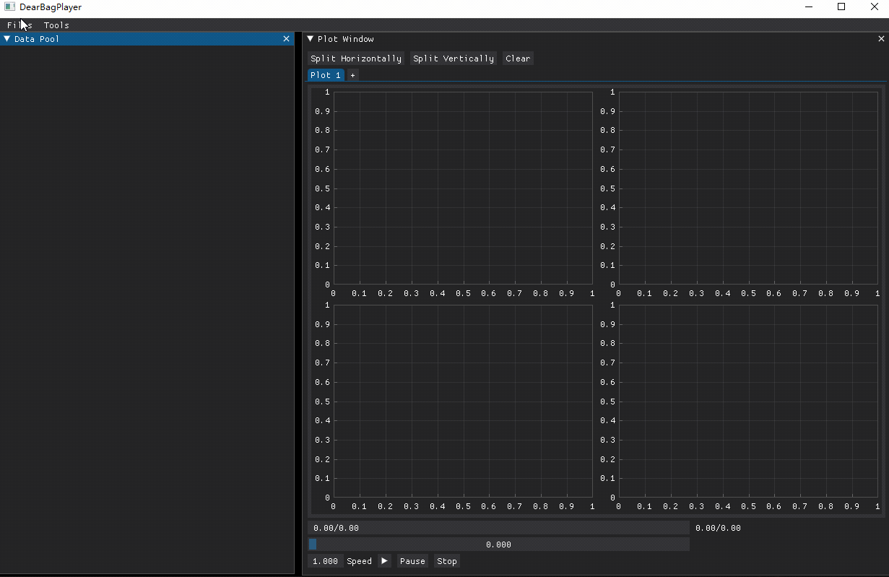
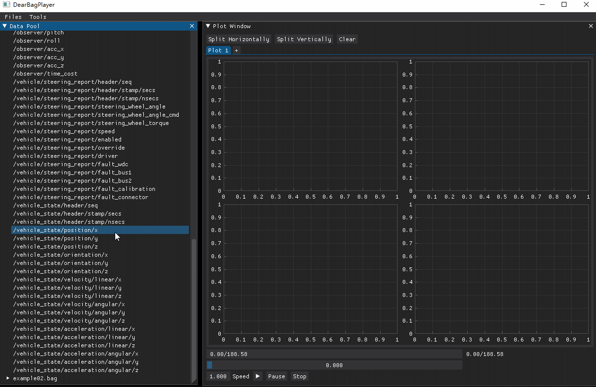
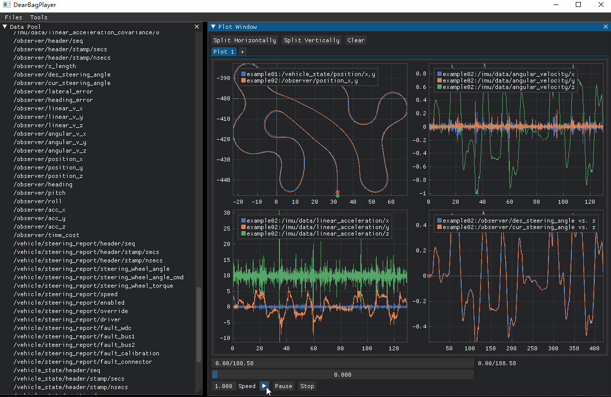
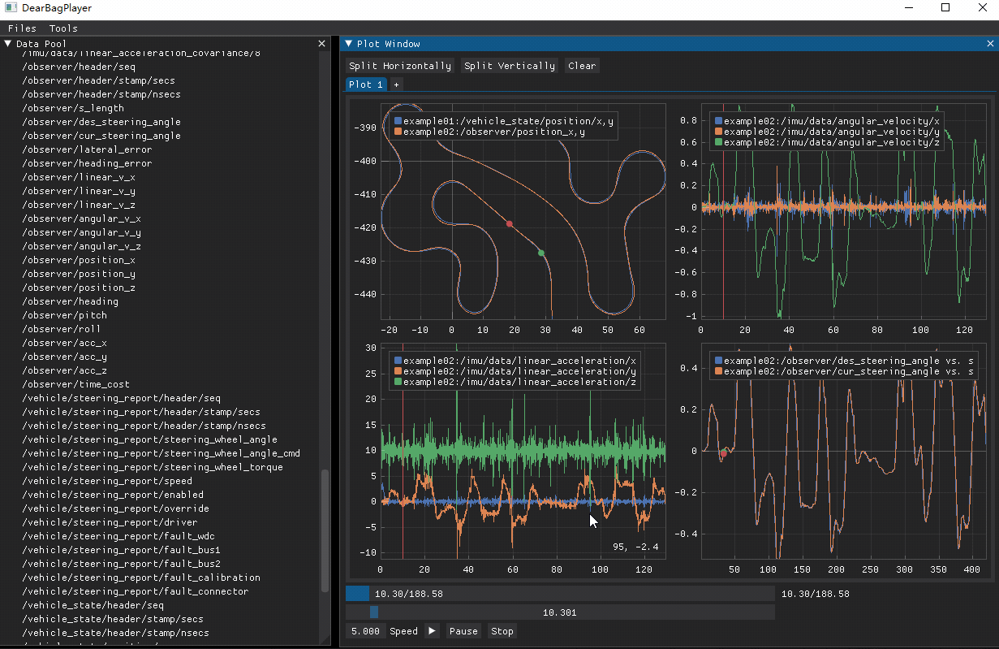

# DearBagPlayer
DearBagPlayer is a flexible rosbag player based on Dear PyGui in Python.

## Quick Start

Install dependencies:

```shell
pip install dearpygui numpy
pip install --extra-index-url https://rospypi.github.io/simple/ rosbag
```

Install DearBagPlayer:

```
pip install dearbagplayer
```

Run DearBagPlayer:

```shell
dearbagplayer
```

See [features](#Features) below to take a quick look at the main features.

This project is still under developing, see [TODO](#TODO) for future work. **Currently DearBagPlayer only supports topics that contain data entities with type of int, float, bool and lists or tuples with fixed size.**

## Dependencies

- Windows 10 or at least Ubuntu 18.04 LTS
- Python 3 - Tested on Python 3.9, should work on other Python 3 versions as well
- [DearPyGui](https://github.com/hoffstadt/DearPyGui)
- NumPy
- rosbag

## Features

### Load data from rosbag files

Load up to 10 bag files each time to load data into the data pool.



### Drag to plot

Select entities first and drag them to the plot area, drop to plot. Three types of plot enabled:

- Time series plot (drag and drop directly)
- XY plot (with `ctrl` key)
- Data vs. travel distance plot (with `shift` key)



### Flexible timeline modification

- Play forward/backward
- Modify play speed
- Sync timestamp by drag timeline
- Play in loop



### Zoom in/out at runtime, create new plot tab, delete and clear plots

- Zoom in/out at runtime
- Create new plot tab
- Delete single plot by right-click button of the legend
- Clear all plots in the activated plot tab with one click




## TODO

- [ ] Rosbag Player
  - [x] Data pool:
    - [x] Get message struct from rosbag
    - [x] Get information of all the topics in a rosbag file
    - [x] Load and maintain a data dict for each topic (especially with different timestamps)
    - [x] Create selectable items for each message entity that has the type of int, float or bool
    - [x] Select bag files (up to 10 each time) to load data into the data pool
    - [x] Select dragged topic when it is not yet selected
    - [ ] Add widgets to specify topics to read from bag files (currently it has the feature of specifying topics in code)
  - [x] Drag and drop callbacks to plot:
    - [x] Drag time series to plot
    - [x] Drag XY plot (drop with `ctrl` key)
    - [x] Drag data vs. travel distance plot (drop with `shift` key)
  - [ ] Timeline management:
    - [x] Play forward/backward
    - [x] Modify play speed (-5 to 5)
    - [x] Sync timestamp by drag timeline
    - [ ] Drag timestamp in a time series plot and sync timeline
    - [x] Add button to enable/disable playing in loop
  - [ ] Plots:
    - [x] Create new plot tab with 2x2 subplots
    - [x] Enable drop callbacks (single time series)
    - [x] Enable drop callbacks (XY plot)
    - [x] Enable drop callbacks (Data vs. travel distance)
    - [x] Clear all plots in the activated plot tab with one click
    - [x] Create new plot tab with one click
    - [x] Enable closing plot tab
    - [x] Enable closing all series in a plot tab
    - [x] Enable renaming plot tab
    - [ ] Resize at runtime
    - [x] Split plots vertically or horizontally at runtime
    - [ ] Copy plots or save to files
  - [ ] Enable live streaming
  - [ ] Enable publishing
  - [ ] Save and load config files
  - [x] Packaging
    - [x] Convert DearBagPlayer to a Python package
    - [x] Add entry point for CLI usage
    - [x] Configure setup
    - [x] Release to PyPI

## License

[MIT License](./LICENSE)
